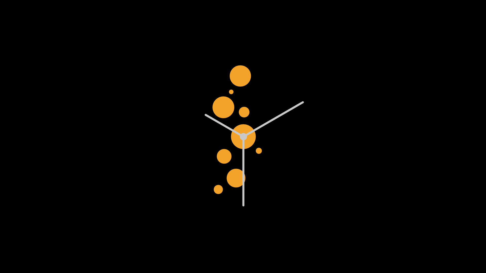

# O-Clock

A live wallpaper clock made using Java Processing

**Look:**

-   [0.0.1](https://github.com/phanirithvij/O-Clock/releases/tag/0.0.1): 
-   [v0.0.4-alpha](https://github.com/phanirithvij/O-Clock/releases/tag/v0.0.4-alpha): 
