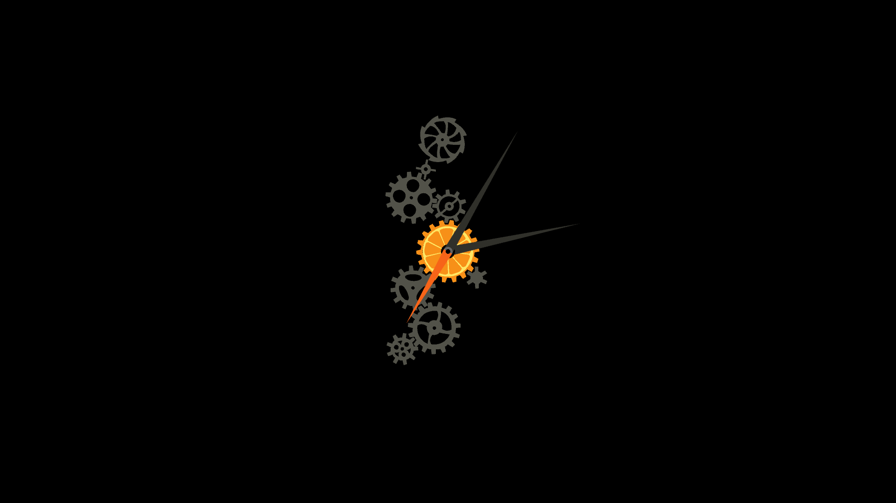

# O-Clock

A live wallpaper clock made using Java Processing

**Look:**

-   [0.0.1](https://github.com/phanirithvij/O-Clock/releases/tag/0.0.1): 
-   [v0.0.4-alpha](https://github.com/phanirithvij/O-Clock/releases/tag/v0.0.4-alpha): 

**Info on gear ratio**

My train of thought:

-   The setup consists two gears and the smaller one is the driver gear.
-   Important: only consider teeth not the radii of the gears.
    -   number of teeth is proportional to the radius
    -   But teeth is the main concern.
    -   In this setup is ratio of radii is used it won't look visually correct.
    -   whenever I talk about ratio of radii it should be treated as teeth ratio.
-   Smaller gear needs to rotate more and fast (always).
-   So angular velocity of smaller one should be faster.
-   If bigger one roates by one deg smaller should rotate by (Rbigger/Rsmaller) degrees.

**In case of gear simple chains**

-   Setup: `a`(driver)->`b`->`c`
-   Now gear if `a` roates by `α` `b` should rotate by `(a/b)*α` thus `c` would rotate by `(b/c) * (a/b)*α` i.e. `(a/c)*α`
-   Thus any diven gear rotates by Rdriver/Ritself \* αdriver
